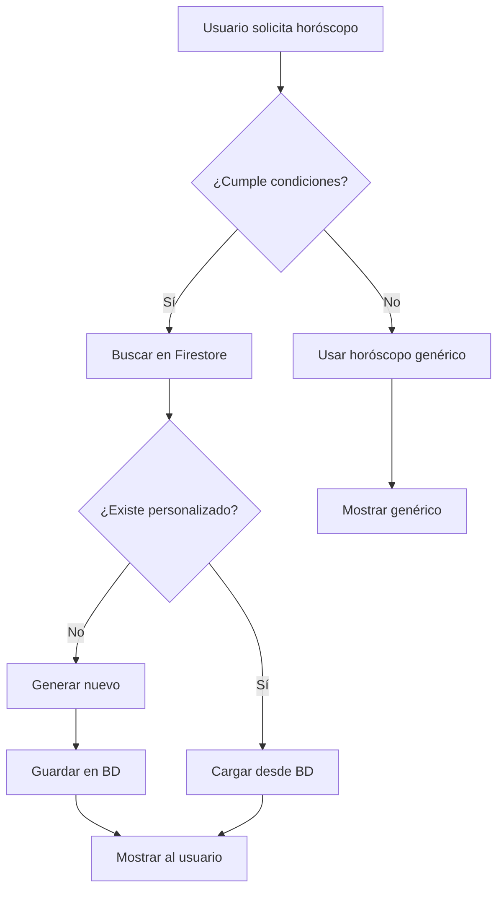

# Sistema de Horóscopos Personalizados

## Descripción
Sistema que genera y almacena horóscopos únicos para cada usuario basados en su información personal (nombre, género, estado de relación, situación laboral), proporcionando una experiencia más personalizada que los horóscopos genéricos.

## Arquitectura

### Estructura de Firestore
```
/horoscopes/personalized/
  ├── {date}/              # YYYY-MM-DD
  │   ├── {locale}/        # es, en, de, fr
  │   │   ├── {sign}/      # Aries, Taurus, etc.
  │   │   │   └── {userId} # UID único del usuario
  │   │   │       ├── main: string
  │   │   │       ├── love: string
  │   │   │       ├── money: string
  │   │   │       ├── health: string
  │   │   │       ├── generatedAt: Date
  │   │   │       ├── sign: ZodiacSignName
  │   │   │       ├── userId: string
  │   │   │       └── personalizationData: {
  │   │   │           name?: string,
  │   │   │           gender?: Gender,
  │   │   │           relationshipStatus?: RelationshipStatus,
  │   │   │           employmentStatus?: EmploymentStatus
  │   │   │       }
```

### Diferencias con Horóscopos Genéricos
| Característica | Genéricos | Personalizados |
|----------------|-----------|----------------|
| **Ruta** | `/horoscopes/daily/{date}/{locale}` | `/horoscopes/personalized/{date}/{locale}/{sign}/{userId}` |
| **Contenido** | Igual para todos los usuarios del signo | Único por usuario |
| **Datos usados** | Solo signo zodiacal | Signo + datos personales |
| **Retención** | 7 días | 14 días |
| **Costo computacional** | Bajo (reutilizable) | Alto (único) |

## Componentes

### 1. Servicio de Firestore
**Archivo**: `src/lib/horoscope-firestore-service.ts`

#### Métodos Principales:
- `savePersonalizedHoroscope()` - Guarda horóscopo personalizado
- `loadPersonalizedHoroscope()` - Carga horóscopo personalizado
- `personalizedHoroscopeExists()` - Verifica existencia
- `cleanOldPersonalizedHoroscopes()` - Limpieza automática

### 2. Hook Personalizado
**Archivo**: `src/hooks/use-personalized-horoscope.ts`

#### Funcionalidad:
- Carga automática desde Firestore
- Generación bajo demanda si no existe
- Manejo de estados de carga y errores
- Integración con el sistema de personalización

### 3. Integración en Componentes
**Archivo**: `src/components/home/AstroVibesHomePageContent.tsx`

#### Lógica de Decisión:
```typescript
const shouldUsePersonalized = useMemo(() => {
  return !!(
    user?.uid && 
    isPersonalizedRequestActive && 
    userSunSign && 
    selectedDisplaySignName === userSunSign.name && 
    onboardingData
  );
}, [user?.uid, isPersonalizedRequestActive, userSunSign, selectedDisplaySignName, onboardingData]);
```

## Flujo de Funcionamiento

### 1. Condiciones para Horóscopos Personalizados
- ✅ Usuario autenticado (`user?.uid`)
- ✅ Modo personalizado activo (`isPersonalizedRequestActive`)
- ✅ Usuario viendo su propio signo (`userSunSign === selectedDisplaySignName`)
- ✅ Datos de onboarding disponibles (`onboardingData`)
- ✅ Período diario (`displayPeriod === 'daily'`)

### 2. Proceso de Carga


### 3. Datos de Personalización
```typescript
interface HoroscopePersonalizationData {
  name?: string;                    // "María"
  gender?: Gender;                  // "female", "male", "other"
  relationshipStatus?: RelationshipStatus; // "single", "relationship", "married"
  employmentStatus?: EmploymentStatus;     // "employed", "student", "unemployed"
}
```

## Beneficios

### Para el Usuario
- 🎯 **Precisión**: Horóscopos adaptados a su situación personal
- 💝 **Conexión**: Uso del nombre y circunstancias específicas
- ⚡ **Velocidad**: Carga rápida desde caché después de la primera generación

### Para el Sistema
- 📊 **Optimización**: Reduce llamadas a IA para contenido reutilizable
- 🗄️ **Eficiencia**: Almacenamiento organizado por usuario
- 🧹 **Mantenimiento**: Limpieza automática de datos antiguos

## Monitoreo y Métricas

### Logs a Vigilar
```
🔮 Iniciando carga de horóscopo personalizado para {userId} - {sign} - {date}
✅ Horóscopo personalizado encontrado en BD para {userId} - {sign}
🤖 Generando nuevo horóscopo personalizado para {userId} - {sign}
✅ Horóscopo personalizado generado y guardado para {userId} - {sign}
```

### Métricas Importantes
- **Tasa de cache hit**: % de horóscopos servidos desde Firestore vs generados
- **Tiempo de respuesta**: Latencia de carga personalizada vs genérica
- **Uso de almacenamiento**: Crecimiento de la colección personalizada
- **Tasa de personalización**: % de usuarios que ven horóscopos personalizados

## Troubleshooting

### Problema: Horóscopos no se personalizan
**Verificar**:
- Estado de autenticación del usuario
- Datos de onboarding completos
- Signo seleccionado == signo del usuario
- Modo personalizado activado

### Problema: Horóscopos se regeneran constantemente
**Verificar**:
- Conexión a Firestore
- Formato de fechas (YYYY-MM-DD)
- Permisos de escritura en Firestore
- Logs de errores en la consola

### Problema: Crecimiento excesivo de almacenamiento
**Verificar**:
- Funcionamiento de la limpieza automática
- Configuración de retención (14 días)
- Logs del sistema de limpieza

## Configuración de Desarrollo

### Variables de Entorno
```env
# Firebase/Firestore configuración
NEXT_PUBLIC_FIREBASE_PROJECT_ID=your-project-id
NEXT_PUBLIC_FIREBASE_API_KEY=your-api-key
# ... otras variables de Firebase
```

### Reglas de Firestore
```javascript
// Permitir lectura/escritura de horóscopos personalizados solo al propietario
match /horoscopes/personalized/{date}/{locale}/{sign}/{userId} {
  allow read, write: if request.auth != null && request.auth.uid == userId;
}
```

## Futuras Mejoras

### Posibles Extensiones
- 📅 **Horóscopos semanales/mensuales personalizados**
- 🎨 **Temas visuales personalizados**
- 📱 **Notificaciones push personalizadas**
- 🔮 **Predicciones a largo plazo basadas en historial**
- 📊 **Dashboard de insights personales**
